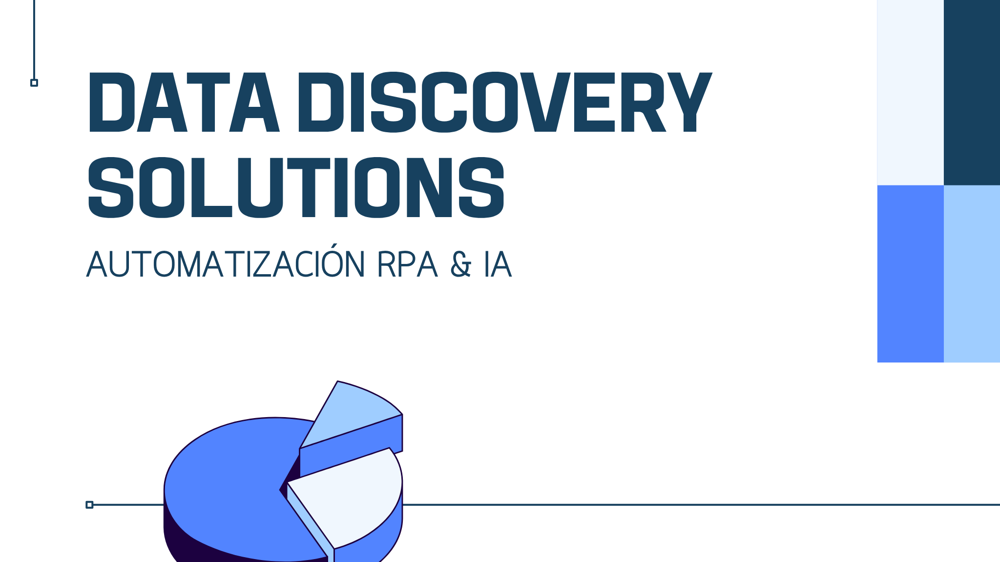

# Sistema RPA de Data Discovery Solutions S.A.C.



Sistema para implementar y gestionar soluciones de automatización RPA & IA para empresas y organizaciones públicas. Proyecto especializado en Azure como infraestructura.

----

#### Clona el proyecto en local:

```bash
curl -fsSL https://raw.githubusercontent.com/ArcGabicho/sistema-rpa-dds/master/setup.sh | bash
```

#### Deployar el proyecto en Azure:

```bash
curl -fsSL https://raw.githubusercontent.com/ArcGabicho/sistema-rpa-dds/master/deploy.sh | bash
```

----

Este proyecto está bajo la licencia MIT. Consulta el archivo [LICENSE.md](LICENSE.md) para más detalles.